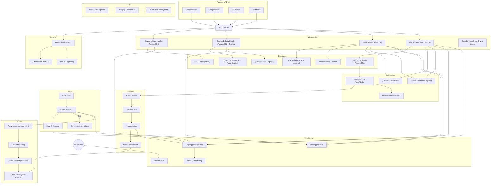

AiCUnet Architektur

Architecture Overview (Mermaid)

```mermaid


```mermaid
flowchart TB

%% ========= FRONTEND UI =========
subgraph Frontend_UI [Frontend Web UI]
    A1[Component A1]
    A2[Component A2]
    Login[Login Page]
    Dashboard[Dashboard]
end

%% Suggestion: React + Zustand, Tailwind, Router
A1 --> Gateway
A2 --> Gateway
Login --> Gateway
Dashboard --> Gateway

%% ========= API GATEWAY =========
%% Handles: Routing, Auth, Rate Limiting, Logging
Gateway[API Gateway]

%% ========= SECURITY =========
subgraph Security
    AuthN["Authentication (JWT)"]
    AuthZ["Authorization (RBAC)"]
    OAuth["OAuth2 (optional)"]
end
Gateway --> AuthN --> AuthZ
AuthN --> OAuth

%% ========= MICROSERVICES =========
subgraph Microservices
    S1["Service 1: Data Handler (PostgreSQL)"]
    S2["Service 2: Data Handler (PostgreSQL + Replica)"]
    S3["Event Sender (Audit Log)"]
    S4["Logger Service (to DBLogs)"]
    S5["Exec Service (Event Driven Logic)"]
end
Gateway --> S1
Gateway --> S2
Gateway --> S3
Gateway --> S4
S1 --> DB1
S2 --> DB2
S3 --> DB3
S4 --> DBLogs

%% ========= SERVICE 5 DETAIL =========
subgraph ExecLogic
    L1[Event Listener]
    L2[Validate Data]
    L3[Trigger Action]
    L4[Send Failure Event]
end
EventBus --> L1 --> L2 --> L3 --> L4
L3 --> LogService
L4 --> DLQ

%% ========= DATABASES =========
subgraph Databases
    DB1["(DB 1 - PostgreSQL)"]
    DB2["(DB 2 - PostgreSQL + Read Replica)"]
    DB3["(DB 3 - Audit/NoSQL optional)"]
    DBLogs["(Log DB - SQLite or PostgreSQL)"]
    AuditDB["(Optional Audit Trail DB)"]
    ReadReplicas["(Optional Read Replicas)"]
end
S3 --> AuditDB
S2 --> ReadReplicas

%% ========= AUTOMATION =========
subgraph Automation
    EventBus["Event Bus (e.g. Node/Redis)"]
    Workflow[Internal Workflow Logic]
    EventStore["(Optional Event Store)"]
    SchemaReg["(Optional Schema Registry)"]
end
DBLogs --> EventBus
EventBus --> Workflow
S3 --> EventStore
S4 --> EventStore
S3 --> SchemaReg
S4 --> SchemaReg

%% ========= SAGA COORDINATOR =========
subgraph Saga
    SagaStart[Saga Start]
    SagaStep1[Step 1: Payment]
    SagaStep2[Step 2: Shipping]
    SagaFail[Compensate on Failure]
end
SagaStart --> SagaStep1 --> SagaStep2
SagaStep1 -->|Fail| SagaFail

%% ========= MONITORING =========
subgraph Monitoring
    LogService["Logging (Winston/Pino)"]
    Alerts["Alerts (Email/Slack)"]
    Tracing["Tracing (optional)"]
    Health[Health Check]
end
S3 --> LogService
S4 --> LogService
SagaStep1 --> LogService
SagaStep2 --> LogService
LogService --> Alerts
S1 --> Tracing
S2 --> Tracing
S3 --> Tracing
S4 --> Tracing
AllServices((All Services)) --> Health

%% ========= ERROR HANDLING =========
subgraph Errors
    Retry["Retry (custom or npm retry)"]
    Timeout[Timeout Handling]
    CBreaker["Circuit Breaker (opossum)"]
    DLQ["Dead Letter Queue (internal)"]
end
SagaStep1 --> Retry --> Timeout --> CBreaker --> DLQ

%% ========= CI/CD =========
subgraph CICD
    Pipeline[Build & Test Pipeline]
    Staging[Staging Environment]
    BlueGreen[Blue/Green Deployment]
end
Pipeline --> Staging --> BlueGreen
```
